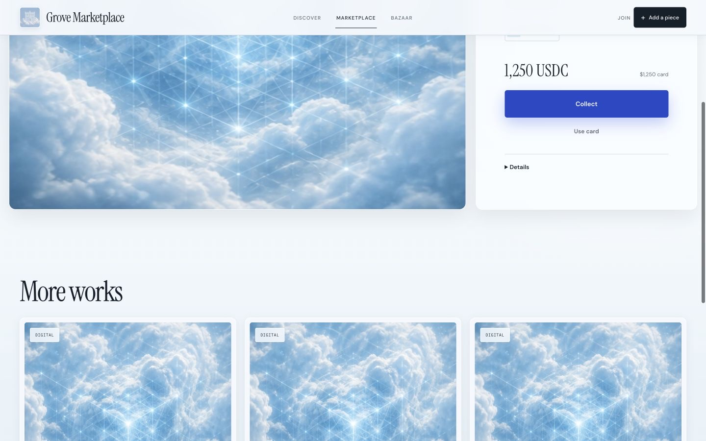

# Grove Marketplace

[](https://github.com/Greenpoint-Compute-Cooperative/grove-marketplace/actions/workflows/ci.yml)
[](https://github.com/Greenpoint-Compute-Cooperative/grove-marketplace/actions/workflows/uptime.yml)
[](LICENSE)

A curator-led marketplace for physical art in the School and born-digital work. The primary loop is discovery → save → sponsor → publish; the monthly auditorium bazaar brings the catalog into New York.

**Live:** [the-school-omega.vercel.app](https://the-school-omega.vercel.app)





## Architecture

- Vanilla HTML, CSS, and ES modules keep the editorial storefront fast; the build copies only runtime assets into `dist/`.
- Vercel Functions in `api/` provide OAuth, session, profile, curator-workflow, catalog, and acquisition-state boundaries.
- Supabase provides Auth and Postgres. The migration in `supabase/migrations/` creates curators, discoveries, sponsorships, works, bazaar events, and acquisitions with row-level security.
- First-party product events are session-scoped, server-validated, private by default, aggregated behind an operator token, and deleted after 180 days.
- The bundled catalog remains available when the backend is absent. OAuth and checkout never claim success without real configuration.

See [`docs/ARCHITECTURE.md`](docs/ARCHITECTURE.md) for trust boundaries and [`docs/ENVIRONMENTS.md`](docs/ENVIRONMENTS.md) for production/preview isolation.

The repository uses dedicated production and preview Supabase projects in US East plus the `dmarzzzs-projects/the-school` Vercel project. Database migrations are applied independently, and Preview/Development receive synthetic data only. Instagram and X remain visibly disabled until their dedicated provider apps, policy URLs, and credentials are approved.

## Run the interface

```sh
npm ci
npm run dev
```

Open [http://localhost:8013](http://localhost:8013). This static mode intentionally shows Instagram and X as not configured.

## Configure the backend

1. Create or choose a dedicated Supabase project, then inspect and apply the migration:

   ```sh
   supabase link --project-ref <project-ref>
   supabase db push --dry-run
   supabase db push
   ```

2. Configure Instagram and X in Supabase using [`docs/OAUTH_SETUP.md`](docs/OAUTH_SETUP.md). Keep both enable flags false until each consent/callback flow passes staging.
3. Copy `.env.example` to `.env.local` or pull the linked Vercel environment. The publishable key serves authenticated RLS requests. The Supabase secret, metrics token, and cron secret are server-only and must never enter static files or public-prefixed variables.
4. Add values to the correct Vercel environment scopes, then verify:

   ```sh
   npm run config:check
   npm run ci
   vercel build
   ```

5. Run `vercel dev` only after local variables are present. Deploy a preview, complete provider review and end-to-end OAuth checks, then promote deliberately.

## Validate

```sh
npm run ci
npm audit --omit=dev
npm run live:check
```

## Routes

- `#home` — seed image and discovery entry
- `#discover` — New, Saved, and Sponsored discoveries
- `#sponsor` — curator work draft
- `#join` — Instagram/X-only OAuth entry
- `#market` — physical, digital / NFT, and paired works
- `#work/:slug` — detail with honest crypto/card preview
- `#curators` / `#curator/:id` — sponsors and selections
- `#bazaar` — monthly auditorium program and calendar export
- `/api/health` — live database and integration readiness, without secrets
- `POST /api/events` — same-origin, allowlisted, session-scoped product events
- `GET /api/metrics?days=30` — bearer-protected aggregate operator feed
- `/api/cron/metrics-retention` — Vercel-authenticated 180-day cleanup

## Product notes

- [`LAUNCH.md`](LAUNCH.md) — MVP, curator-first GTM, NFT launch path, and launch sequence
- [`DESIGN.md`](DESIGN.md) — identity and visual system
- [`docs/OAUTH_SETUP.md`](docs/OAUTH_SETUP.md) — provider, consent, privacy, and deletion checklist
- [`docs/METRICS.md`](docs/METRICS.md) — event dictionary, funnels, privacy, and interpretation
- [`docs/RUNBOOK.md`](docs/RUNBOOK.md) — deploy, rollback, incident, secret, and provider operations
- [`docs/ENVIRONMENTS.md`](docs/ENVIRONMENTS.md) — isolated production, preview, and local setup
- [`docs/PRODUCTION_BACKLOG.md`](docs/PRODUCTION_BACKLOG.md) — prioritized pilot, commerce, reliability, and growth work
- [`docs/GENERATED_ASSETS.md`](docs/GENERATED_ASSETS.md) — source and generated-asset disclosure

## Contribute

Start with [`CONTRIBUTING.md`](CONTRIBUTING.md). Pull requests run deterministic Node 24 CI, repository contract checks, tests, a production build, dependency audit, and retain a reviewable static artifact. Bug, product, and rights/provenance issue forms are available; vulnerabilities go through the private path in [`SECURITY.md`](SECURITY.md).

The code is available under the [MIT License](LICENSE). Tagged releases rebuild the app, rerun CI, and publish a checksummed static artifact.

The supplied floating-school image is the marketplace’s primary mark. Catalog records are fictional prototype content. Wallet, contract, card, inventory, media retrieval, and RSVP integrations are not connected.
