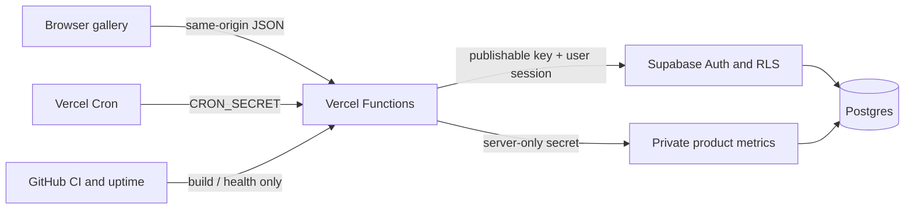

# Architecture

Grove is a deliberately small web application with a strict trust boundary: the gallery can render without a backend, but identity, private curator state, metrics, and future acquisition state cross same-origin Vercel Functions before reaching Supabase.

## Runtime

- `index.html`, `styles.css`, `catalog.js`, `analytics.js`, and `app.js` are a vanilla, hash-routed gallery copied into `dist/` by `scripts/build-static.mjs`.
- `api/` uses Web `Request` and `Response` handlers on Vercel Functions.
- `lib/server/` owns configuration validation, cookies, Supabase clients, and HTTP validation.
- Supabase Auth holds provider identities and PKCE sessions. Postgres holds curator, discovery, sponsorship, work, bazaar, acquisition, and product-event records.
- The browser gets only a publishable Supabase key indirectly through server clients. `SUPABASE_SECRET_KEY`, metrics read access, and cron authorization exist only in Vercel Functions.

## Data boundaries

| Data | Visibility | Authority |
|---|---|---|
| Listed works and published bazaars | Public | Postgres + RLS |
| Curator discoveries and sponsorship drafts | Owning curator | Supabase session + RLS |
| Provider tokens and identities | Supabase Auth | Provider consent |
| Product events | No browser read access | Server-only RPC |
| Metrics summary | Bearer-protected operator API | Server-only aggregate RPC |
| Payments, mints, inventory | Disabled | Future reviewed providers |

The bundled catalog is editorial prototype content and remains the visual fallback until real records are published. It is never an authoritative sale, token, or inventory ledger.

## Environments

- **Production:** stable Vercel alias and the dedicated US East Supabase project. First-party metrics may write only here.
- **Preview:** dedicated US East Supabase project with synthetic records; OAuth, acquisition, and metrics stay disabled.
- **Development:** static `npm run dev`, or `vercel dev --listen 8013` with the same synthetic preview project.

Preview and Development never receive the production Supabase secret. Do not copy production rows into the preview project.

## Change rules

- Add a new timestamped migration; never rewrite one applied to production.
- Every public table requires RLS and explicit grants. Server-only tables receive no `anon` or `authenticated` grants.
- Keep integrations behind flags until callbacks, failure paths, revocation, and authoritative reconciliation pass.
- Do not put provider secrets, service keys, or admin tokens in client modules, static files, screenshots, logs, or GitHub Actions.
