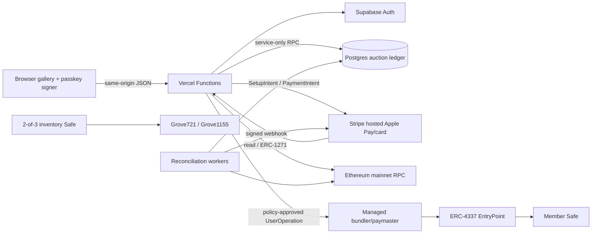

# Architecture

The marketplace is a small web application with explicit authorities for identity, auctions, payments, and Ethereum. The gallery renders without a backend; nothing financial or onchain can claim success from browser state.

## Runtime

- The editorial storefront is vanilla HTML/CSS/ES modules. esbuild creates one exact-pinned browser-only Ethereum intent bundle. In a fully configured Sepolia Preview, that bundle asks the user's discoverable passkey to sign a server-canonical bid with the attested Safe configuration; passkey private material and raw credential IDs stay in the authenticator/browser boundary.
- Vercel Functions own request validation, social sessions, Stripe calls, ERC-1271 checks, sponsorship policy, and provider credentials. The auction workers select the winner, freeze one provider-calculated total, and bind one off-session PaymentIntent; an authenticated hosted cure can replace it only after the retrieved-current prior intent is canceled.
- Supabase Auth holds social-provider identities and PKCE sessions. Postgres owns auction order, payment state, NFT custody projections, and append-only events.
- Ethereum mainnet owns NFT identity, inventory, member Safe state, transfers, and canonical receipts. Indexers are read models only.
- A managed ERC-4337 bundler/paymaster is replaceable behind a Grove adapter. It never becomes auction or ownership authority.

## Data boundaries

| Data | Visibility | Authority |
|---|---|---|
| Published work and auction projection | public | Postgres after reconciliation |
| Social identity and provider tokens | private | Supabase Auth/provider consent |
| Social-to-Safe association | owning member/operator only | one-time ERC-1271 link proof |
| Passkey private material | never leaves authenticator | user-controlled Safe |
| Credential commitment/recovery status | owning member/operator only | Postgres + Safe reconciliation |
| Bid signature, mandate, payment attempt | bidder/operator only | Postgres + current chain/provider check |
| Public bid feed | public pseudonymous projection | Postgres |
| NFT ownership/finality | public | Ethereum mainnet |
| Gas sponsorship | private audit log | policy decision + UserOperation receipt |

OAuth subjects, handles, email, credential IDs, authenticator metadata, payment method IDs, signatures, and wallet links never enter NFT metadata or public tables.

## Invariants

- Every auctionable work is first finalized in the dedicated inventory Safe.
- One work maps to one collection/token identity; an ERC-1155 cap is minted in full before sale.
- One v1 auction has one settlement rail, high bid, winner, and settlement.
- Bids are EIP-712 intents checked through ERC-1271 before row-locked acceptance and again at close.
- Stripe redirects and direct worker observations never authorize settlement. A payment mandate requires both current off-session SetupIntent success and accepted terms from its matching completed Checkout Session; signed settlement webhooks are reconciled against the one bound current PaymentIntent before entering `paid-risk-hold`.
- NFT release requires a cleared payment/crypto settlement, risk gate, idempotent delivery record, and finalized chain receipt.
- Grove sponsors only allowlisted Ethereum actions; it never takes unilateral recovery control.

## Environments and changes

- Production uses isolated Vercel, Supabase, Stripe, RPC, bundler, and paymaster resources. Preview/development use synthetic identities, payment methods, wallets, and NFTs.
- Add timestamped migrations; never rewrite an applied production migration.
- Every table has RLS and explicit grants. Server-only commerce mutation functions are unavailable to browser roles.
- Production wallet/auction readiness stays deliberately false until code hashes, provider approval, tax, terms, recovery, audit, and reconciliation gates pass. A complete Sepolia configuration may expose the narrowly labeled Preview rehearsal without changing either production attestation.
- Never put service keys, provider tokens, RPC credentials, passkey material, Safe owner material, or deployer keys in static files, logs, screenshots, or CI artifacts.

See [the master plan](LIVE_MARKETPLACE_MASTER_PLAN.md) for the complete lifecycle and gate checklist.
