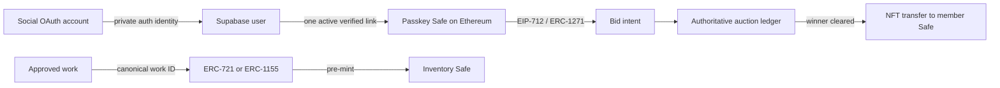

# Live marketplace master plan

Status: implementation candidate, 2026-09-03. This document supersedes the earlier Base/fixed-price launch plan.

## Product decision

Grove is a curated, primary-market auction house on Ethereum mainnet.

- Every approved work has a canonical NFT before bidding opens: ERC-721 for a unique work, ERC-1155 for an edition.
- The NFT is issued to a dedicated 2-of-3 Grove inventory Safe, then transferred to the winner's Safe after final payment clearance.
- A member joins with approved social OAuth, then creates a user-controlled, passkey-first Safe smart account. The private social identity-to-wallet link lives in Postgres; raw handles, OAuth subjects, emails, and credential IDs never go onchain.
- Grove pays gas for supported marketplace actions through an ERC-4337 paymaster. Members do not need ETH to create their Safe, sign bids, receive a work, or perform the supported marketplace actions. Product copy must say this precisely; the paymaster cannot fund bid principal, arbitrary wallet activity, or provider outages.
- The default auction is offchain and authoritative in Postgres. Every bid is nevertheless an EIP-712 intent signed by the bidder's Safe and verified through ERC-1271.
- Card auctions use Stripe-hosted Apple Pay/card setup, offchain bids, a winner-only charge attempt, an interactive cure when required, a risk hold, then NFT transfer.
- Crypto auctions are a separate rail. A lot has exactly one immutable settlement rail in v1; card and crypto bids do not compete in the same auction.
- Collector-to-collector sales are a third, isolated product boundary. The first secondary release is fixed-price
  ERC-721 for USDC through Seaport; it never uses Stripe or Apple Pay. See
  [Secondary-market release policy](./SECONDARY_MARKET.md).

The last rule is deliberate. Mixing reversible card money and irreversible crypto in one winner calculation creates unequal finality, chargeback, custody, tax, and cancellation behavior. A cross-rail English auction is a later, separately audited product.

## What “associated with social” means



Social OAuth is discovery, identity, and session context—not wallet custody. It must never be a signer, Safe owner, recovery key, gas authority, or public token attribute. Account recovery requires a second user-controlled passkey or a separately reviewed recovery module. Grove cannot unilaterally take over a member Safe.

No public “social identity NFT” is required. It would make revocation and privacy unnecessarily difficult. If a public badge is wanted later, use an opt-in revocable attestation containing only a salted, domain-separated commitment; never include a handle, OAuth subject, email, credential ID, or authenticator identifier.

## Trust and authority

| Decision | Authority | Evidence before UI claims success |
|---|---|---|
| Social login | Supabase Auth | current provider session |
| Social-to-Safe link | Postgres `wallet_links` | one-time origin-bound challenge + ERC-1271 at a recorded block |
| Gas sponsorship | sponsorship policy service | approved decision + UserOperation hash + canonical receipt |
| Work identity | `Grove721` / `Grove1155` | finalized Ethereum log, collection code hash, token ID, work ID |
| NFT inventory | Ethereum mainnet | finalized owner/balance equals dedicated inventory Safe |
| Auction order | Postgres | auction-row lock and append-only bid/event ledger |
| Bid authorization | bidder Safe | EIP-712 hash + ERC-1271 magic value at recorded block |
| Apple Pay/card readiness | Stripe + Postgres | current off-session SetupIntent `succeeded`, matching completed Checkout terms consent, saved method, unexpired per-lot mandate |
| Winner | Postgres close transaction | close-time revalidation of winning ERC-1271 signature |
| Card payment | Stripe + Postgres | current PaymentIntent `succeeded`, exact amount/currency/tax, signed webhook |
| Crypto payment | canonical Ethereum receipt | correct asset/amount/recipient and finality |
| NFT delivery | Ethereum mainnet | inventory Safe transfer receipt finalized and reorg checked |
| Physical shipment | fulfillment operator | NFT delivery final plus recorded carrier evidence |

Browser redirects, client clocks, cached indexers, screenshots, and Stripe event payload snapshots are never authoritative.

## Minimal open-source stack

| Capability | v1 choice | Boundary |
|---|---|---|
| Web/API | current static app + Vercel Functions | small same-origin surface |
| Identity/data | Supabase Auth + Postgres/RLS | OAuth and commerce system of record |
| NFT contracts | OpenZeppelin 5.6.1 + immutable Grove contracts | no proxy, auction, escrow, or forced transfer logic |
| User account | Safe 1.4.1 | user-controlled smart account |
| Account abstraction | Safe 4337 module 0.3.0 + canonical EntryPoint 0.7 | native ERC-4337 lane |
| Passkeys | Safe Passkey 0.2.1-1 | primary signer; second factor/recovery required |
| Browser Ethereum | exact-pinned viem 2.56.3, permissionless 0.4.0, ox 0.11.3 | isolated browser bundle |
| Fiat/Apple Pay | Stripe-hosted Checkout/SetupIntent/PaymentIntent | no custom Apple Pay certificate UI |
| Bundler/paymaster | managed provider behind a Grove adapter | operational vendor can change |
| Self-hosting exit | Alto | GPL service isolated from the application; never run as a Vercel Function |
| Secondary crypto order boundary | exact-pinned OpenSea SDK/Seaport.js + audited Seaport release | fixed-price ERC-721/USDC first; server-side API adapter only |
| Optional read model | Ponder | never commerce authority |

ERC-4337 defines smart-account validation, UserOperations, bundlers, and paymasters without changing Ethereum consensus. [ERC-4337](https://eips.ethereum.org/EIPS/eip-4337) Safe publishes the relevant audited account and module components; exact deployed addresses and code hashes must be pinned and rehearsed. [Safe smart account](https://github.com/safe-global/safe-smart-account) · [Safe modules](https://github.com/safe-fndn/safe-modules) Alto is a practical self-hosted exit but needs a persistent service, node access, funded executors, simulation, monitoring, and 24/7 operations. [Alto](https://github.com/pimlicolabs/alto)

Do not add ERC-6551, ERC-7579, upgradeable collection proxies, a custom card oracle, a custom paymaster contract, a custom exchange, or a custom hybrid-auction contract in v1.

## NFT lifecycle

1. Curator creates a work draft from a permitted source.
2. Operator clears sale, media, mint, license, and—where applicable—physical-fulfillment rights.
3. Operator freezes the work's canonical `bytes32 workId`, content-addressed metadata URI, license URI, royalty signal, collection, token ID, and edition cap.
4. Registrar configures the immutable work record.
5. Minter issues the one-of-one or entire edition cap to the dedicated inventory Safe.
6. Reconciler checks chain ID 1, deployed collection code hash, mint log, token/work binding, URI, royalty, supply, inventory owner/balance, block hash, and finality.
7. Only then does Postgres move the work to `nft_custody_state = inventory-safe` and permit an auction to open.
8. After winner payment clearance and risk release, the inventory Safe transfers the correct quantity to the winner Safe.
9. Reconciler records included/finalized/reorged state. Physical fulfillment starts only after final NFT delivery.

The NFT and a physical object cannot move atomically. Terms must say what the token represents, what rights transfer, what happens after loss/damage/return, and whether possession of the token is merely provenance, a license, or a redemption claim. ERC-2981 is a royalty signal, not guaranteed enforcement.

### Collection constraints

`Grove721` and `Grove1155` are non-proxy contracts with:

- one immutable inventory Safe;
- a unique canonical work ID ↔ token ID binding;
- immutable complete `ipfs://` metadata;
- per-token ERC-2981 royalty information;
- full ERC-1155 edition issuance up front;
- domain-bound, idempotent issuance IDs;
- registrar, minter, pause guardian, and delayed-admin roles separated;
- pause affecting new inventory issuance only, never collector transfers;
- no checkout, bid, escrow, recovery, upgrade, clawback, or royalty-enforcement logic.

Deploy only on Sepolia (`11155111`) for rehearsal and Ethereum mainnet (`1`) for production. The exact release commit, compiler, optimizer, dependencies, constructor arguments, runtime bytecode, Safe owners/thresholds, roles, and explorer verification must be recorded.

## Member wallet lifecycle

1. Member authenticates through approved Instagram or X OAuth.
2. In a secure browser origin, a WebAuthn credential is created; private material remains in the authenticator.
3. The browser derives the expected Safe account using the pinned Safe proxy, singleton, fallback handler, 4337 module, shared WebAuthn signer, P-256 verifier, factory, and EntryPoint tuple. For the pinned Safe 4337 initializer, the module is also the fallback handler, so both configured addresses and runtime code hashes must be identical.
4. `POST /api/wallet/sponsor` evaluates a narrowly allowed account-deployment UserOperation.
5. Managed bundler submits it; the backend verifies canonical EntryPoint and Safe logs from its own mainnet RPC.
6. The member signs an origin-, nonce-, chain-, expiry-, and account-bound link challenge. The backend code-hash attests the tuple; reads the Safe fallback slot, owners, threshold, and enabled module; verifies the per-Safe WebAuthn public-key commitment; verifies ERC-1271; and writes one protected wallet link.
7. Before valuable bidding or delivery, the member adds a second passkey or approved user-controlled recovery configuration and completes a recovery drill.

Deploy the Safe before bidding. Counterfactual signature support such as ERC-6492 is intentionally deferred because it adds factory-call and verifier complexity.

Ethereum supports standardized P-256 verification, but the exact Safe/permissionless representation of the native verifier still needs compatibility testing. Begin with the audited Safe-supported verifier path, benchmark gas on a mainnet fork, and do not cast an address-shaped field into an unchecked packed verifier value. [EIP-7951](https://eips.ethereum.org/EIPS/eip-7951)

### Sponsorship policy

The sponsorship service allows only:

- chain ID 1 and the pinned EntryPoint, Safe factory, module, verifier, and code hashes;
- verified account deployment, recovery management, bid cancellation, and explicitly allowlisted marketplace transfers;
- zero ETH call value by default;
- bounded call gas, verification gas, pre-verification gas, priority fee, total fee, validity, and retry count;
- per-member, per-account, per-IP, daily, and global spend budgets;
- exact allowlisted target/selector pairs; no arbitrary approvals, transfers, delegatecalls, fallback calls, or unknown targets.

Every approval and rejection records policy version, request key, user/account, normalized policy input, quote, provider, UserOperation hash, transaction hash, actual cost, and rejection code. Provider credentials remain server-only. A global circuit breaker stops new sponsorship without blocking receipt reconciliation.

## Bid protocol

An offchain bid is real crypto authorization even though it does not move funds. The browser signs this EIP-712 structure:

```text
BidIntent(
  bytes32 auctionId,
  bytes32 workId,
  address bidderSafe,
  uint256 amount,
  bytes32 currency,
  uint256 nonce,
  uint64 validAfter,
  uint64 validUntil,
  bytes32 termsHash,
  uint8 settlementRail,
  bytes32 origin
)
```

The domain is `name = Grove Marketplace`, `version = 1`, `chainId = 1`. Auction UUID and browser origin are domain-separated hashes. Amounts are integers: cents for USD, token base units for USDC/WETH. EIP-712 supplies typed, domain-separated signing; ERC-1271 verifies contract-account signatures. [EIP-712](https://eips.ethereum.org/EIPS/eip-712) · [ERC-1271](https://eips.ethereum.org/EIPS/eip-1271)

Bid acceptance performs:

1. same-origin request, authenticated active member, request-size and format validation;
2. finalized, recovery-ready Safe linked to that member;
3. NFT finalized in the inventory Safe;
4. auction open at the server clock, correct rail/currency/terms, valid signature window;
5. current ERC-1271 check at a recorded block;
6. current card mandate or crypto-order eligibility;
7. unique intent hash, per-account nonce, and idempotency key;
8. auction-row lock, minimum increment, maximum bid, and deterministic anti-sniping extension;
9. append-only bid/audit event and exactly one current high bid.

At close, the worker locks the auction, rereads the canonical block, and revalidates the winning ERC-1271 signature because Safe owners can change after bid acceptance. It then selects zero or one winner and creates zero or one settlement. Close and retry are idempotent.

## Apple Pay/card auction

“Bid with Apple Pay” means Apple Pay/card establishes payment eligibility; it is not the bid ledger, crypto wallet, or gas source.

1. Before the first bid on a card lot, Stripe-hosted Checkout runs in setup mode for that specific auction.
2. The member explicitly accepts the auction terms and a disclosed maximum hammer amount. Checkout can show Apple Pay on eligible devices and save the resulting payment method for off-session use.
3. A retrieved-current SetupIntent must be `succeeded` for `off_session` use, and the matching completed Checkout Session must carry accepted terms. Neither event alone makes the mandate ready; a redirect never does.
4. Bids remain signed EIP-712 intents in Postgres. Grove does not authorize every bid and does not place a long-lived card hold for each bid.
5. At close, freeze a non-null settlement/cure deadline, then calculate current tax/shipping and freeze the total. Create one unconfirmed PaymentIntent with a stable idempotency key, atomically bind it as the settlement's current generation, then confirm it off-session. A replacement generation is allowed only after Stripe is retrieved-current and reports the named prior generation `canceled`; an intent that failed or awaits customer action must first be completed or canceled.
6. `requires_action` or decline moves the settlement to an interactive cure window using fresh hosted Checkout. It does not silently charge another method.
7. Only a signed, retrieved-current PaymentIntent `succeeded` event with exact amount/currency and an idempotently committed Stripe Tax Transaction enters `paid-risk-hold`; `paid_at` and the hold deadline derive from that event, never the earlier calculation.
8. After the configured risk hold, no open Radar review, unresolved Early Fraud Warning, refund, or dispute, and an operator release policy, queue the inventory Safe transfer. Stripe's `actionable=false` does not clear an Early Fraud Warning; clearance requires separate, fresh provider/operator resolution evidence. Successful refunds require a matching Stripe Tax reversal before their financial event is accepted.
9. A dispute after delivery becomes `disputed-post-mint`; the contract does not pretend the NFT can be clawed back.

Do not authorize each bid. Ordinary online card authorizations are commonly measured in days, so they are not a durable auction escrow. [Stripe authorization holds](https://docs.stripe.com/payments/place-a-hold-on-a-payment-method) Off-session payment requires explicit consent and may still need customer action. [Stripe SetupIntents](https://docs.stripe.com/payments/setup-intents) · [Apple Pay recurring/off-session](https://docs.stripe.com/apple-pay/apple-pay-recurring)

Stripe's public restricted-business list requires approval for first-party NFT minting/sales and prohibits or restricts
secondary NFT transactions and some auction models. Written approval for Grove's exact art, **primary** NFT,
high-value auction, Apple Pay, off-session, refund, chargeback, tax, and merchant-of-record facts is a release blocker.
Stripe and Apple Pay must never buy, settle, fund, guarantee, or cure a collector-to-collector NFT sale under the
current rules. [Stripe restricted businesses](https://stripe.com/legal/restricted-businesses)

Apple Pay does not buy gas, top up a wallet, or convert the member's card bid into an onchain bid.

### Settlement state machine

```text
winner-selected
  → tax-pending
  → charge-pending
  → processing | requires-action | payment-failed
  → paid-risk-hold
  → release-ready
  → nft-submitted
  → nft-finalized
  → fulfilled

Any state → exception
Before NFT release → refunded
After NFT release → disputed-post-mint
```

`paid-risk-hold` requires current payment success, exact total/currency, a committed Tax Transaction, and a hold derived from authoritative `paid_at`. Release additionally requires no open provider review, unresolved Early Fraud Warning, refund, or dispute and a verified winner wallet. The NFT worker accepts only `release-ready` rows.

## Crypto auction rail

Crypto lots are disabled in the first invited beta. When enabled, prefer a pinned audited Seaport release for WETH or Ethereum-mainnet USDC orders rather than a home-grown exchange. [Seaport](https://github.com/ProjectOpenSea/seaport) Circle publishes the canonical Ethereum USDC address and supported contract behavior; pin it by address and code hash at launch. [Circle USDC contract addresses](https://developers.circle.com/stablecoins/usdc-contract-addresses)

For v1 crypto lots:

- one lot is `crypto` from scheduling onward and cannot accept card bids;
- bidder Safe signs the same Grove bid intent plus the rail-specific audited order/allowance needed for settlement;
- Grove can sponsor supported transaction gas, but the bidder supplies WETH/USDC principal;
- close-time checks simulate ownership, balance, allowance, order status, Safe signature, expiry, counter, fees, and recipient;
- chain settlement must finalize before the inventory NFT transfers;
- ownership/recovery changes require explicit order cancellation; they do not automatically cancel old orders.

A strict onchain English-auction contract is a later option only after an independent specification and audit. It must never be bolted into the card auction.

## Secondary-market rail

OpenSea ended all testnet support on July 23, 2025, so Sepolia staging cannot depend on an OpenSea collection page,
testnet API, metadata refresh, or order relay. [OpenSea: Farewell,
Testnets](https://support.opensea.io/en/articles/11833955-farewell-testnets) The authorized staging path is direct,
exact-pinned Seaport on Sepolia with Grove-owned RPC verification and reconciliation.

The first secondary-sales release is fixed-price ERC-721 for USDC only. It excludes ERC-1155, WETH/native ETH,
offers, auctions, bundles, criteria orders, cross-chain execution, and all card rails. The buyer supplies USDC
principal; a paymaster may sponsor only explicitly allowed gas. ERC-2981 is advisory royalty information and does not
guarantee payment or enforcement.

Production OpenSea support requires a separately audited mainnet collection deployment and minted token, durable IPFS
availability for metadata and media, actual OpenSea indexing, and a server-side OpenSea API key. Never expose that key
in the browser and never invent a collection slug before OpenSea returns it. The complete order, settlement,
cancellation, metadata, and release gates live in [Secondary-market release policy](./SECONDARY_MARKET.md).

## API and worker inventory

| Route / worker | Purpose | v1 status |
|---|---|---|
| `GET /api/config` | public capability flags only | implemented, fail closed |
| social OAuth routes | member session | implemented; provider-gated |
| `POST /api/wallet/challenge` | one-time wallet-link challenge | implemented, disabled by gates |
| `POST /api/wallet/link` | ERC-1271 wallet link | implemented, disabled by gates |
| `POST /api/wallet/sponsor` | policy-check and forward UserOperation | provider adapter gate |
| `GET /api/auctions/:id/bids` | privacy-safe public bid feed | implemented |
| `GET /api/auctions/:id/bid-context` | authenticated canonical Safe/WebAuthn bid context | implemented for pre-provisioned recovery-ready Safes |
| `POST /api/auctions/:id/payment-setup` | per-auction Stripe setup session | implemented, disabled by gates |
| `POST /api/auctions/:id/bids` | verify Safe signature and atomically accept bid | implemented, disabled by gates |
| `POST /api/stripe/webhook` | signed setup/payment/refund/dispute inbox | implemented foundation |
| auction close worker | revalidate signature and select winner once | implemented, disabled by gates |
| tax/charge worker | calculate/freeze total, bind one intent, attempt winner payment | implemented, disabled by gates; pending provider rehearsal |
| payment-cure endpoint | cancel the current failed/action-required intent and bind one fresh hosted winner checkout | implemented, disabled by gates; pending provider rehearsal |
| NFT inventory reconciler | prove mint/custody/finality/reorg state | pending mainnet provider selection |
| NFT release worker | 2-of-3 Safe transfer after release gate | pending custody runbook/audit |
| sponsorship reconciler | verify UserOperation receipt and spend | pending provider selection |
| financial reconciler | compare Stripe, ledger, tax, refund, dispute | fixed-price foundation exists; auction extension pending |

“Implemented” does not mean enabled in production. The server helpers permit gated preview rehearsal, but production wallet/auction mutation routes hard-fail independently of their public flags until a reviewed release changes the deliberately false `liveReady` attestation after every environment, provider, contract, legal, and operational gate is satisfied.

## Data model

The `20260904000000_hybrid_auction_foundation.sql` migration adds:

- `smart_accounts`, private credential commitments, wallet links, and sponsorship decisions;
- collection deployment/code-hash records and canonical NFT identity/custody fields on works;
- auctions, private mandates, append-only signed bids, auction events, settlements, payment attempts, and chain deliveries;
- provider-event links for auction setup and settlement;
- row-locked, idempotent bid acceptance and close primitives;
- privacy-safe public auction/bid projections;
- RLS and explicit read-only grants for a member's own sensitive state; browsers cannot mutate the commerce ledger directly.

Private tables never expose social identifiers beside wallet addresses to public roles. Public bid aliases are deterministic only within one auction, deliberately change across auctions, and are not identity claims.

## Reconciliation and reorg policy

- Read canonical receipts/logs from at least one production Ethereum RPC; a second provider is the outage/corruption cross-check.
- Record transaction hash, block number, block hash, expected log identity, confirmation count, and finalization time.
- `included` is not `finalized`. UI uses distinct labels.
- If an included mint or transfer disappears or its block hash changes, mark `reorged`, stop related auction/release work, and reconcile before retry.
- Never let an indexer decide payment, ownership, finality, or inventory correctness.
- Reconcile inventory Safe balances against every `inventory-safe` work and edition quantity at least daily and before each open/close/release.
- Reconcile paymaster spend to policy decisions and receipts; stop sponsorship at daily/global budget thresholds.

## Security invariants

- One approved work ID maps to one collection/token tuple.
- No auction opens without finalized inventory custody.
- One lot has one immutable settlement rail.
- One bid intent hash and bidder nonce can be accepted once.
- One auction has at most one high bid, winner, and settlement.
- No card mandate permits a bid above its disclosed maximum.
- No payment success is inferred from a redirect or stale event snapshot.
- No NFT leaves inventory without `release-ready` and an idempotent delivery record.
- No platform key can recover a user Safe alone.
- No social credential, payment credential, passkey secret, or raw provider token reaches public tables, logs, token metadata, or static assets.
- Collection pause cannot freeze collector transfers.
- Provider and chain retries cannot double-mint, double-charge, double-close, or double-transfer.

The release threat-model suite must cover cross-origin requests, forged and stale signatures, ERC-1271 ownership rotation, nonce replay, amount/currency/terms mismatch, anti-sniping races, duplicate/out-of-order webhooks, SetupIntent/PaymentIntent retrieval disagreement, chargeback after mint, paymaster budget exhaustion, malicious UserOperation targets/selectors/value, RPC disagreement, chain reorg, Safe recovery rotation, and full-edition supply. The repository currently automates the schema/contract subset; provider and end-to-end cases remain launch gates.

## Delivery plan

### Gate 0 — approvals and product terms

- Written Stripe approval for the exact primary NFT and auction flow.
- Counsel confirms merchant/seller-of-record, auction rules, NY and destination tax, refunds, chargebacks, sanctions/KYC thresholds, physical/NFT pairing, custody, and token/license language.
- Insurance/risk owner accepts the possibility of post-mint card disputes.
- Product signs the second-passkey/recovery experience and the precise sponsored-gas promise.

### Gate 1 — Sepolia closed system

- Pin Safe 1.4.1, 4337 module 0.3.0, Passkey 0.2.1-1, EntryPoint 0.7, the proxy/singleton/factory/shared-signer/verifier addresses, and every runtime code hash; require the 4337 module to be the fallback handler.
- Complete passkey account creation, second recovery signer, rotation, lost-device drill, ERC-1271 bid signing, and provider-neutral paymaster adapter.
- Deploy exact Grove contracts to Sepolia with separate 2-of-3 admin and inventory Safes.
- Exercise configure → pre-mint → custody proof → bid → close → synthetic pay → transfer → finality/reorg recovery.
- Run mainnet-fork gas benchmarks and set per-user/day/global sponsorship budgets.
- Exercise the isolated secondary path directly against pinned Sepolia Seaport: fixed-price ERC-721 for allowlisted
  test USDC, Safe signature, approval, fill, cancellation, canonical receipt, finality, and reorg handling. Do not use
  or claim OpenSea testnet support.

### Gate 2 — Stripe sandbox and operations rehearsal

- Apply all migrations to isolated preview; use synthetic members, work, cards, wallets, and addresses.
- Test eligible Apple Pay devices, saved method, off-session success, decline, `requires_action`, cure, tax/shipping, refund, dispute, duplicate/out-of-order events, provider outage, and manual review.
- Complete operator dashboards, alerts, reconciliation, incident controls, key rotation, and data deletion/export.
- Independent smart-contract audit and application security review close with no critical/high findings.

### Gate 3 — invited Ethereum mainnet beta

- Deploy and verify exact audited collections; register code hashes and Safe custody.
- Pre-mint only a small rights-cleared catalog to inventory.
- Enable card auctions for a capped invited cohort, low maximum hammer, conservative risk hold, daily human release, and global kill switches.
- Keep crypto lots, automated NFT release, secondary sales, public attestations, and physical redemption disabled.

### Gate 4 — controlled automation

- Automate release only after enough reconciled, dispute-free production history.
- Enable crypto-only lots behind separate Seaport/code-hash/simulation gates.
- Launch secondary sales only through their own gate: fixed-price ERC-721/USDC first, exact mainnet contracts and
  token, durable IPFS, server-side OpenSea API key, verified indexing, and completed fill/cancel/reorg reconciliation.
- Expand limits gradually based on authorization, fraud, dispute, support, paymaster, mainnet gas, and reorg metrics.

## Production blockers as of this plan

1. Written Stripe approval for this exact NFT/auction/deferred-charge model has not been supplied.
2. Exact Safe/module/passkey/EntryPoint mainnet addresses and code hashes are not registered or integration-tested.
3. A managed bundler/paymaster provider and provider-neutral adapter are not selected/rehearsed.
4. Wallet provisioning/sponsor routes, recovery UX, provider-rehearsed release operations, and complete payment/chain reorg reconcilers remain to be implemented.
5. The modified Grove inventory-mint contracts require independent audit and Sepolia rehearsal.
6. Production contract addresses, inventory/admin Safe owners, role holders, RPCs, keys, tax policy, risk hold, maximum bid, and catalog rights records are intentionally unset.
7. The storefront now contains the gated payment-setup and discoverable-passkey signed-bid UI; real-device accessibility, authenticator interoperability, and end-to-end provider rehearsal remain required.
8. Secondary sales still require pinned Sepolia Seaport/USDC rehearsal and an independent production gate. OpenSea no
   longer supports Sepolia; production integration requires a mainnet collection/token, durable IPFS, and a
   server-only OpenSea API key.

No production deploy, contract broadcast, provider mutation, real charge, or mainnet mint is authorized by this document.
