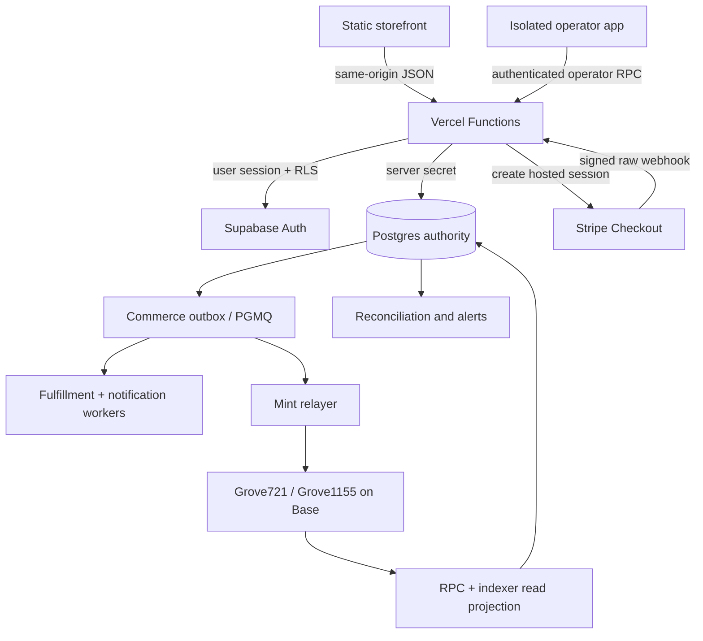
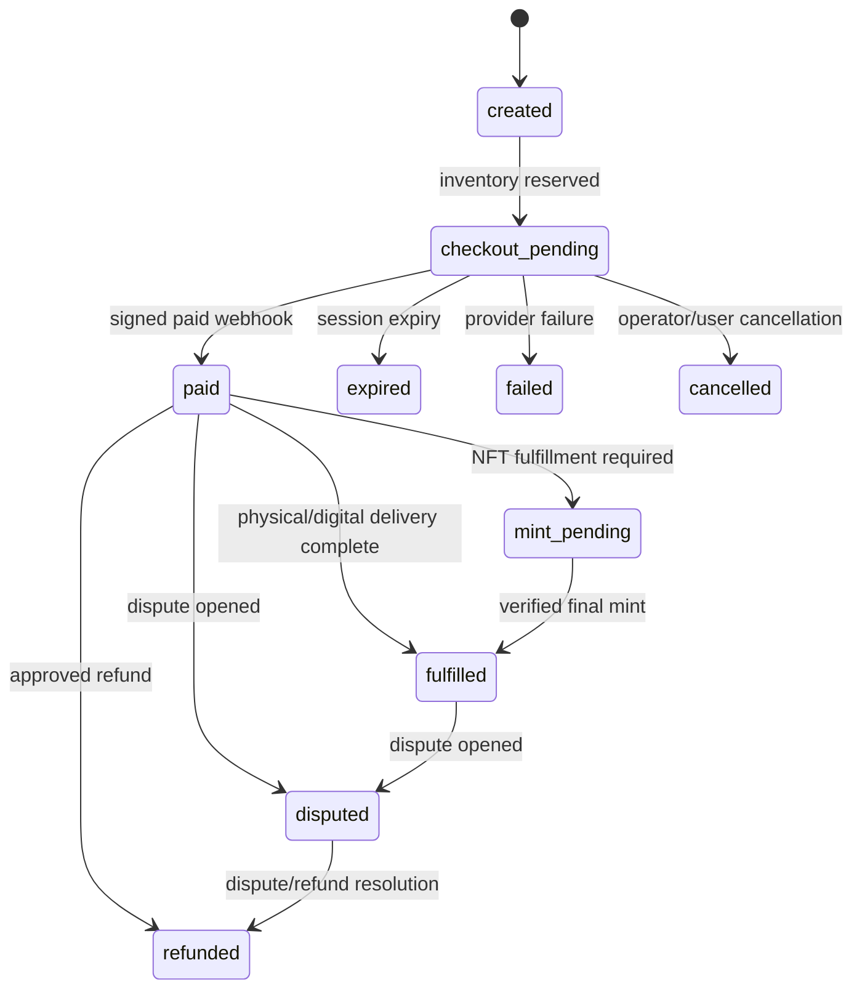

# Live marketplace master plan

**Audience:** owner, product, engineering, security, finance, operations, and retained counsel
**Decision date:** September 2, 2026
**Launch geography:** United States, operated from New York City
**Code baseline:** `grove-marketplace/main` v1.0.6
**Delivery branch:** `codex/live-marketplace`

## Executive decision

Launch a curator-led **fixed-price primary market** before adding English auctions or secondary NFT trading.

- Keep the fast vanilla storefront, same-origin Vercel Functions, and Supabase/Postgres/RLS.
- Make Postgres the single authority for rights, seller readiness, price, inventory, reservation, payment, and fulfillment.
- Use Stripe-hosted Checkout for card payments. On eligible Apple devices, Checkout presents Apple Pay without a custom
  Apple Pay UI or Apple merchant-certificate implementation. Apple Pay remains a normal card payment; it never funds a
  wallet or buys crypto. [Stripe Apple Pay](https://docs.stripe.com/apple-pay)
- Treat the School as disclosed merchant/seller of record under signed artist consignment for v1. Artist payouts use
  ordinary accounts payable. If the legal model changes to independent sellers, migrate to Stripe Connect hosted
  onboarding and separate charges/transfers rather than quietly changing the fund flow.
- Use Base for new NFTs, with immutable OpenZeppelin-based ERC-721 and ERC-1155 collection contracts. Contracts deliver
  a token only after an authoritative order settles; they do not take card payments, escrow physical art, hold buyer
  funds, force transfers, guarantee royalties, or run a bespoke exchange.
- Keep card checkout, minting, and later auctions behind separate fail-closed feature flags. No browser redirect can mark
  an order paid or minted.

This plan preserves the launch catalog—physical work, new NFTs, editions, paired work, and verified existing tokens—while
keeping the first commercial system small enough to rehearse, audit, and operate.

## What is already shipped on the delivery branch

The branch contains a production-shaped, disabled-by-default foundation:

- a forward Supabase migration for sellers, rights assertions, inventory, idempotent reservations, provider-event
  inbox, refund ledger, dispute state, fulfillment records, commerce outbox, and append-only audit events;
- a transactional `reserve_card_checkout` database boundary that locks inventory and refuses unpublished, auction,
  NFT/paired, seller-incomplete, terms-incomplete, tax-incomplete, or rights-incomplete works;
- an invited-member-only Stripe-hosted Checkout endpoint built from the server-authoritative physical-work price, with
  buyer terms consent, card/Apple Pay only, automatic tax, and a safe 35-minute reservation window;
- a raw-body, signed Stripe webhook receiver that remains active when new sales are disabled, retrieves current provider
  state, and idempotently handles checkout, refund, and dispute events;
- a ten-minute reconciliation endpoint for stale reservations and missed payment/expiry webhooks;
- a checkout-status endpoint that reads the authenticated buyer's reconciled Postgres order, not a browser redirect or
  Stripe session claim;
- live catalog/curator/bazaar hydration from Postgres; fictional fixtures are used only when the backend is absent;
- an Apple Pay/card storefront action that remains disabled unless the work and full server configuration are ready;
- immutable-IPFS `Grove721` and capped `Grove1155` mint contracts, idempotent by domain-bound acquisition-order hash;
- Foundry unit tests proving authorization, one-time configuration, order idempotency, supply caps, royalty signalling,
  and that emergency mint pausing never freezes collector transfers;
- pinned OpenZeppelin, Stripe SDK, Foundry test dependency, and CI contract execution;
- migration of the Supabase X provider default from legacy `twitter` to current `x`.

Nothing in this branch enables real money or deploys a contract. `GROVE_ACQUISITION_ENABLED` remains false by default,
existing prototype works remain `sale_enabled = false`, and no production address or credential is invented.

The implementation was verified with the full Node/build/Foundry CI suite, 1,000-run contract fuzz cases, a zero-finding
production dependency audit, and a disposable-Postgres test—also installed as a dedicated CI job—that applies every migration and exercises idempotent
reservation, strict paid-event validation/replay, full refund state, and archived-work expiry. This is engineering
evidence, not a substitute for provider underwriting, legal/tax approval, real-device Apple Pay testing, static contract
analysis, Base Sepolia rehearsal, or independent contract audit.

## Product boundary

The repository uses “Auction House” as identity but currently states “no auction countdown,” while its own launch plan
places auctions in phase two. This plan therefore treats auction capability as a new financial subsystem, not a missing
button.

“Philanthropy” also needs an owner definition before money moves. The current product has curatorial sponsorship, not a
charitable beneficiary, donation receipt, or donated-proceeds ledger. Choose exactly one model:

1. ordinary mission-driven art commerce;
2. a disclosed percentage of School proceeds donated after sale; or
3. regulated charitable solicitation/payment to a named eligible nonprofit.

Only model 1 is in the launch design. Models 2–3 require new pricing, accounting, receipt, beneficiary, Apple/provider,
and charitable-solicitation review.

## Target architecture

Rules:

- `works`, `rights_assertions`, and inventory decide whether checkout may start.
- One acquisition owns one inventory reservation; only one payment rail may settle it.
- Stripe objects carry only internal UUIDs. Shipping and buyer data stay in Stripe or protected tables, never token
  metadata or public event logs.
- Signed webhooks enter a unique inbox before state changes. Duplicate and out-of-order delivery is normal and harmless.
- Paid orders create outbox work. Fulfillment and minting are idempotent consumers, not synchronous webhook side effects.
- Contract events are reconciled to the order ledger before the UI claims ownership or delivery.
- Product analytics are not operational observability. Payments, queues, database calls, and chain reconciliation receive
  structured logs, correlation IDs, traces, and alerts.

## Commercial state model

Never transition from browser success, client-supplied price, a submitted transaction hash, or an indexer callback alone.
Every transition records actor, reason, source event, and previous/new state.

## Apple Pay and card checkout

### Fixed-price launch flow

1. The browser requests a card checkout using a per-attempt idempotency key.
2. A database function locks the work row, checks the active seller, current seller terms, buyer terms/license, unexpired
   seller-bound rights assertions, tax code, fixed-price physical format, server price, and inventory, then decrements one unit.
3. The server creates one card-only Stripe-hosted Checkout Session using that reservation. It collects a US shipping
   address, requires terms consent, and calculates tax automatically.
4. Checkout presents Apple Pay when the buyer, device, browser, region, and account are eligible. Hosted Checkout needs
   no custom Apple Pay button or certificate integration. [Stripe hosted Checkout](https://docs.stripe.com/payments/checkout)
5. A signed `checkout.session.*` webhook retrieves the current Session and idempotently marks the acquisition paid,
   failed, or expired. Refund and dispute events update the ledger/state; the success URL is informational only.
   [Stripe webhooks](https://docs.stripe.com/webhooks)
6. A paid event creates fulfillment work. Inventory returns only once on failure/expiry; a paid one-of-one becomes sold.
7. Reconciliation compares open database reservations to provider sessions and retries or alerts without creating a
   second charge.

The platform uses a platform charge under the v1 consignment assumption. It does **not** call money held before artist
payment “escrow.” If independent sellers become the legal sellers, use Connect hosted onboarding and separate
charges/transfers when funds must be split or delayed; the platform remains responsible for indirect-charge fees,
refunds, disputes, and negative balances. [Stripe Connect charge types](https://docs.stripe.com/connect/charges)

### Card auctions later

Do not authorize each bid. Online authorizations usually expire in five to seven days, so a long-running auction cannot
rely on a durable card hold. [Stripe authorization windows](https://docs.stripe.com/payments/place-a-hold-on-a-payment-method)

The phase-two flow is:

- before a first bid, use hosted setup mode to save a payment method with explicit consent for an off-session,
  variable winning-bid charge;
- store the accepted auction-terms version, timestamp, IP, maximum-bid consent, and payment-mandate reference;
- accept bids through one serializable database function with server time, minimum increment, idempotency, and a defined
  anti-sniping rule;
- at close, lock the lot, determine the winner, create one order, and enqueue one off-session charge;
- if authentication or a decline blocks payment, issue a short cure Checkout where Apple Pay can be authorized again;
- auction terms decide the cure period and whether default goes to the underbidder or relisting.

This flow requires written Stripe/Apple approval for the actual auction and deferred Apple Pay model before implementation.

## Smart contracts

### Production candidates

`Grove721` is a non-proxy ERC-721 + ERC-2981 collection for one-of-one work. `Grove1155` is a non-proxy ERC-1155 +
ERC-1155 Supply + ERC-2981 collection for editions.

Both contracts:

- permanently configure token URI, royalty receiver, and royalty basis points before sale;
- domain-bind a PII-free `orderId` to chain, collection, acquisition line, token, recipient, and quantity, then refuse
  to process it twice;
- separate registrar, minter, pause, and delayed default-admin roles;
- let an incident guardian pause mint delivery while only the admin Safe may unpause;
- never let the platform pause or seize collector transfers;
- contain no payable purchase function, oracle, proxy, forced transfer, denylist, public burn, or token rescue;
- emit `WorkConfigured` and `OrderMinted` records for reconciliation.

ERC-2981 is a royalty signal, not enforcement; its specification says payment is voluntary. Product and artist terms must
not claim guaranteed secondary royalties. [EIP-2981](https://eips.ethereum.org/EIPS/eip-2981)

### Network and key model

- Base Sepolia: rehearsal, chain ID `84532`.
- Base mainnet: production candidate, chain ID `8453`, only after approvals and audit.
- Default admin: dedicated 2-of-3 Safe with three named people/devices and hardware-backed keys.
- Treasury: separate 2-of-3 Safe; never reuse contract-admin signers.
- Minter: KMS/HSM-backed relayer with only `MINTER_ROLE` and minimal ETH.
- Pause guardian: separate incident key; it can pause minting but cannot unpause or administer.
- Deployer: no enduring role after source verification and role handoff.

Base distinguishes quick L2 inclusion from L1 batching/finality. The UI must expose meaningful submitted/included/final
states, and high-value physical release waits for the business-approved stronger finality threshold.
[Base transaction finality](https://docs.base.org/base-chain/network-information/transaction-finality)

### Crypto payment boundary

For v1, the lowest-custom-code option is an expiring server order and a buyer transfer of Circle-native Base USDC to a
separate merchant treasury Safe, subject to provider/legal approval. A verifier checks the expected chain, canonical
token address, sender, recipient, exact amount, receipt success, transfer log index, uniqueness, and finality through
independent RPC/indexer paths. It then enqueues mint or fulfillment. The platform never asks for a seed phrase or holds a
buyer private key.

Do not deploy a custom exchange or bid-escrow contract for launch. If secondary orders later become lawful and approved,
evaluate the MIT-licensed, audited Seaport protocol rather than inventing a general exchange. Seaport still does not
solve English-auction bidding, fiat reversibility, physical fulfillment, tax, or custody.
[Seaport](https://github.com/ProjectOpenSea/seaport)

## Server and API inventory

| Boundary | Status | Purpose and authority |
|---|---|---|
| `GET /api/config` | implemented | Browser-safe flags; never reveals secrets. |
| `GET /api/catalog` | implemented | Postgres-backed works/curators/bazaars hydrate the UI; add cursor pagination and FTS before scale. |
| `POST /api/acquisitions` | implemented, disabled | Authenticated invited-member physical reservation and hosted Checkout from server price. |
| `GET /api/acquisitions` | existing | Authenticated buyer-facing acquisition projection. |
| `POST /api/stripe/webhook` | implemented | Signed, current-provider-state checkout/refund/dispute ingestion; survives sales kill switch. |
| `GET /api/checkout-status` | implemented | Authenticated minimal reconciled order state; no fulfillment claim or PII. |
| `GET /api/cron/commerce-reconcile` | implemented | Cron-authenticated stale reservation/provider reconciliation every ten minutes. |
| `POST /api/orders/:id/cancel` | next | Release only eligible unpaid reservations; expire provider session first. |
| `POST /api/operator/orders/:id/refund` | next | Operator-authorized refund with provider idempotency and ledger event. |
| `POST /api/operator/orders/:id/fulfill` | next | Physical/digital completion evidence and notification. |
| `POST /api/operator/works/:id/publish` | next | Atomic rights, price, inventory, media, seller, and contract readiness gate. |
| `POST /api/crypto/orders` | gated | Expiring USDC quote/reservation from server-authoritative price. |
| `POST /api/crypto/orders/:id/submit` | gated | Record one transaction hash; never assert success. |
| chain reconciliation worker | gated | Verify canonical USDC transfer, finality, uniqueness, and rail exclusivity. |
| mint worker | gated | Idempotent KMS/HSM relayer; reconcile `OrderMinted` before fulfillment. |
| `POST /api/sellers/connect*` | conditional | Add only if independent-seller/Stripe Connect model is approved. |
| `POST /api/bidders/payment-setup` | phase two | Hosted consented setup for future auction winner charge. |
| `POST /api/auctions/:id/bids` | phase two | Serializable bid acceptance, append-only events, rate/abuse limits. |
| auction close/cure worker | phase two | One winner/order/payment attempt, then defined cure/default behavior. |

Operator mutations require a real operator identity, role-separated RLS/RPC authorization, recent re-authentication for
finance actions, reason fields, append-only audit events, and two-person approval for high-value refund/payout/mint repair.
Do not reuse the metrics bearer token as an operator credential.

## Data and worker backlog

The shipped migration is the safe minimum. Add these forward-only migrations before their matching feature turns on:

- `media_assets`: private quarantine, SHA-256, detected type/size, rights, derivatives, alt text, retention, replacement;
- `inventory_units`: per-object serial, condition, location, consignment, reservation, paired token, fulfillment owner;
- richer `payment_attempts`, refunds, and dispute-case records around the shipped provider inbox and refund ledger;
- `shipping_quotes`, `fulfillments`, and return records for physical work;
- `token_deliveries` with expected chain/contract/token/order and submitted/included/finalized/reconciled states;
- `notifications` plus a durable PGMQ/commerce-outbox consumer;
- later `auctions`, `bids`, `bidder_payment_mandates`, `auction_events`, and `settlements`.

Use PGMQ/Supabase Queues for email, media-scan dispatch, reservation expiry, webhook reconciliation, mint delivery, and
chain reconciliation. Consumers delete only after success and make every external effect idempotent. Supabase Cron is a
trigger, not a durable queue. [Supabase Queues](https://supabase.com/docs/guides/queues)

## Open-source and managed component policy

| Need | Launch choice | License / boundary |
|---|---|---|
| Database, auth, RLS, API, realtime, storage | Supabase/Postgres | OSS components around one Postgres authority; managed operations. |
| Search | Postgres weighted FTS + GIN | PostgreSQL License; defer a second search index until measured need. |
| Durable jobs | PGMQ/Supabase Queues + bounded consumers | Postgres-native; business effects still idempotent. |
| Contracts | OpenZeppelin 5.6.1 + Foundry | MIT; pin exact releases and audit custom code. |
| Admin UI | React-admin in an isolated bundle | MIT; Postgres roles remain authoritative. |
| Email templates | React Email | MIT; buy SES/Postmark/Resend delivery instead of operating SMTP. |
| Telemetry | OpenTelemetry | Apache-2.0; buy a hosted error/trace backend. |
| Browser tests | Playwright | Validate pinned package license; test Chromium/WebKit/Firefox. |
| Load tests | k6 | AGPL-3.0; use unmodified tooling and review redistribution policy. |
| Media | Supabase Storage + isolated scanner | Private quarantine; buy scanner operations or isolate ClamAV. |
| NFT publication | redundant IPFS remote pins | IPFS is not durable without pinning; publish approved public assets only. |
| Secondary orders | Seaport, only if later approved | MIT and audited; not a launch or English-auction dependency. |
| Chain projection | Ponder, conditional | MIT; require backfill/reorg/restore soak before adopting. |

Do not replatform to Medusa or Saleor at launch. The current art-domain workflow already exists, while either platform
would add a second commercial source of truth and significant synchronization/operations work. Add Meilisearch, Novu,
GrowthBook, Redis, or a persistent worker only after production measurements justify them.

## Security and verification gates

### Application and payments

- Separate production, preview, and local Supabase/Stripe environments; previews contain synthetic data and no commerce.
- Keep all provider mutations behind deterministic idempotency keys. Stripe recommends idempotency for every POST and
  retains v1 results for at least 24 hours. [Stripe idempotency](https://docs.stripe.com/error-low-level)
- Verify webhook signatures over the unmodified raw body; treat retries, duplicates, and out-of-order events as normal.
- Enforce same-origin checkout creation, request-size limits, server-side catalog price, tax, inventory row lock, and
  feature flag.
- Add rate limits and bot/fraud controls to reservation and future bid routes without allowing rate-limit state to become
  the inventory authority.
- Reconcile stale reservations/provider sessions every ten minutes; reconcile paid orders, refunds, disputes, outbox
  depth, payouts, and fulfillment daily.
- Redact shipping, identity, payment, and wallet data from logs; define retention and deletion by data class.
- Enable PITR/backups, execute a restore drill, and name incident/data-request owners.

### Contracts

- Unit and fuzz every role, zero value/address, token ID, quantity, cap, order ID, receiver, and transition.
- Stateful invariants: one order mints once; supply never exceeds cap; only configured work mints; metadata/cap/royalty
  cannot change; paused minting never blocks collector transfer.
- Add adversarial receiver/reentrancy, smart-contract-wallet, duplicate job, wrong-chain, and indexer-disagreement tests.
- Run Slither/static analysis, reproducible compilation, gas snapshots, full custom-branch coverage, and Base Sepolia
  rehearsals.
- Commission an independent audit of the exact commit and bytecode. Launch with zero unresolved critical/high findings.
- Publish source, compiler settings, constructor args, ABI, chain ID, addresses, bytecode hash, metadata CIDs, audit
  report, and final role holders.

## Legal, tax, provider, and rights gates

These are release dependencies, not footnotes:

1. Obtain written Stripe approval for high-value art, fixed-price primary NFTs, paired works, Apple Pay, maximum values,
   fraud/refund model, and the chosen merchant/seller-of-record structure. Stripe publicly restricts primary NFT and
   high-value-goods activity and prohibits secondary NFT sales.
   [Stripe restricted businesses](https://stripe.com/legal/restricted-businesses)
2. Obtain a New York Certificate of Authority and configure collection/remittance before physical sales. New York says a
   marketplace that provides the forum and collects receipts must collect tax on taxable tangible personal property,
   including physical art. [NYS marketplace providers](https://www.tax.ny.gov/pubs_and_bulls/publications/sales/marketplace.htm)
3. Have New York counsel approve consignment/seller terms, returns, authenticity, physical fulfillment, reserve and bid
   rules, buyer premium, seller bidding, failed-payment cure, and any secondhand-dealer license obligation.
4. Determine Form 1099 reporting for artist payouts and 1099-DA/broker status for any digital-asset sale. The 2026 IRS
   instructions expressly address specified NFTs. [IRS 1099-DA](https://www.irs.gov/instructions/i1099da)
5. Keep crypto noncustodial and obtain NYDFS/FinCEN/OFAC advice before the platform holds, routes, exchanges, or controls
   customer value. [NYDFS virtual-currency licensing](https://www.dfs.ny.gov/apps_and_licensing/virtual_currency_businesses)
6. For every work, record seller authority, provenance, media permission, sale right, mint authorization where relevant,
   edition/cap, price, tax class, license, condition/location, fulfillment owner, refund treatment, and sanctions review.
7. Never imply that an NFT transfers copyright. Publish per-work rights terms and a durable license reference.
   [USPTO/USCO NFT study](https://www.copyright.gov/policy/nft-study/)

## Delivery sequence

### Gate 0 — owner decisions and approvals (target: 1–2 weeks)

- Define philanthropy, legal seller/merchant of record, primary versus secondary inventory, return policy, artist split,
  buyer premium, supported countries, maximum order value, and physical-release rules.
- Name legal/tax, finance, editorial, security, incident, data-request, and fulfillment owners.
- Obtain preliminary Stripe underwriting response and New York tax/licensing advice.
- Choose production domain, monitoring provider, Supabase PITR tier, Safe signers, RPC/indexer providers, and audit budget.

**Exit:** signed decision record; no unresolved contradiction in money flow, rights, or product claims.

### Gate 1 — invited commerce pilot (target: 2–4 weeks after Gate 0)

- Apply the commerce migration to isolated preview, seed only synthetic seller/rights/inventory data, and race-test the
  reservation RPC.
- Build the operator publish/rights/inventory/fulfillment/refund views and role matrix.
- Configure Stripe sandbox, automatic tax, signed webhook, event replay, refund/dispute tests, and synthetic reconciliation.
- Add private media quarantine/scanning and Postgres FTS/pagination.
- Run WebKit/Safari/device checks for Apple Pay eligibility and honest fallback behavior.

**Exit:** 100 repeated and concurrent test purchases with zero double reservation, duplicate effect, or false success;
refund/expiry/provider-outage drills pass.

### Gate 2 — live fixed-price physical market (target: 1–2 weeks after Gate 1)

- Publish a small rights-cleared consignment catalog and cap order values.
- Enable card checkout only for approved physical works; run staffed manual fulfillment and daily reconciliation.
- Start with invited buyers, then widen gradually under explicit error/chargeback/support thresholds.

**Exit:** 30 days with no inventory incident, unreconciled payment, material tax defect, or missed high-severity alert.

### Gate 3 — primary NFT and paired delivery (audit schedule dependent)

- Rehearse exact contracts on Base Sepolia; finalize metadata/license/pinning and relayer security.
- Audit the exact release, deploy from reproducible settings, verify source/bytecode, transfer roles to Safes, and publish
  addresses only after reconciliation.
- Add paid-order mint outbox, relayer, redundant RPC/indexer verification, and paired physical hold/release workflow.
- Enable a few capped primary works after written provider/legal approval; no secondary sales.

**Exit:** every mint maps one-to-one to a paid acquisition, supply matches, and all ten wrong-network/retry/sold-out/paired
failure rehearsals pass.

### Gate 4 — auction subsystem (only after stable fixed-price operation)

- Approve auction terms and payment mandate with provider/counsel.
- Add append-only bids, serializable acceptance RPC, abuse controls, deterministic close, winner charge, cure/default,
  refunds/disputes, and operator reconciliation.
- Run high-concurrency close tests and moderated bidder usability sessions.

**Exit:** no ambiguous winner, duplicate charge, stale authorization assumption, bid-retraction defect, or inventory drift.

## Reliability targets

- Public reads: 99.9% monthly; authenticated writes: 99.5% during pilot.
- Zero false paid/minted/fulfilled claims, duplicate mints, supply drift, or double-sold physical works.
- Webhook acknowledgement under provider timeout; all slow work deferred to a durable queue.
- Open reservation/provider mismatch alert within five minutes; live-bazaar SEV-1 acknowledgement within 15 minutes.
- Commerce kill switch invoked immediately for provider, ledger, tax, inventory, or chain disagreement.
- Every deploy reproducible from a reviewed commit; every schema change forward-only; every provider has a kill switch.

## Decision and evidence gap matrix

| Decision | Current answer | Confidence | Remaining gap / owner |
|---|---|---:|---|
| Core platform | Keep Vercel + Supabase/Postgres | High | PITR tier, monitoring, incident owner |
| First sale mode | Fixed-price primary | High | Owner must accept auction deferral |
| Apple Pay | Stripe-hosted Checkout | High technically | Written Stripe eligibility and real-device test |
| Seller model | School merchant under consignment | Medium | Counsel, finance, artist agreement |
| Payment splits | Ordinary AP in v1; Connect if independent sellers | High conditionally | Final legal seller model |
| Tax | Stripe automatic tax plus NY registration | High for physical works | Digital/paired classification and filing owner |
| NFTs | Immutable mint-only ERC-721/1155 on Base | High technically | Provider/legal approval, audit, metadata rights |
| Existing tokens | Read-only verification / primary inventory only | Medium | Define whether any are secondary sales |
| Crypto pay | Exact native USDC to merchant Safe, gated | Medium | Custody/licensing opinion and provider choice |
| Secondary market | Not in v1 | High | Stripe prohibits secondary NFT processing |
| English auctions | Phase two, offchain bids first | High | Terms, mandate approval, cure/default policy |
| Philanthropy | Undefined; excluded from money flow | High as a gap | Owner/nonprofit/legal definition |
| Admin keys | 2-of-3 admin Safe + separate treasury/relayer/guardian | High | Named signers/devices and recovery drill |
| Media | Private Storage quarantine + scan; redundant public IPFS pins | High | Scanner, retention, pinning SLA |

## Immediate owner checklist

- [ ] Define philanthropy in one sentence and choose whether it changes checkout, accounting, or receipts.
- [ ] Confirm School-as-merchant consignment or choose independent sellers/Connect.
- [ ] Confirm that launch NFTs are primary artist inventory only.
- [ ] Submit the complete business model to Stripe and obtain written approval.
- [ ] Engage New York marketplace/auction/payments/digital-asset and tax counsel.
- [ ] Register for New York sales tax and select filing/remittance ownership.
- [ ] Name the six operating owners and three Safe signers.
- [ ] Fund independent contract audit and Base Sepolia rehearsal.
- [ ] Provide a rights-cleared seed catalog; prototype records cannot be sold.
- [ ] Approve the staged launch gates; do not turn on `GROVE_ACQUISITION_ENABLED` early.
